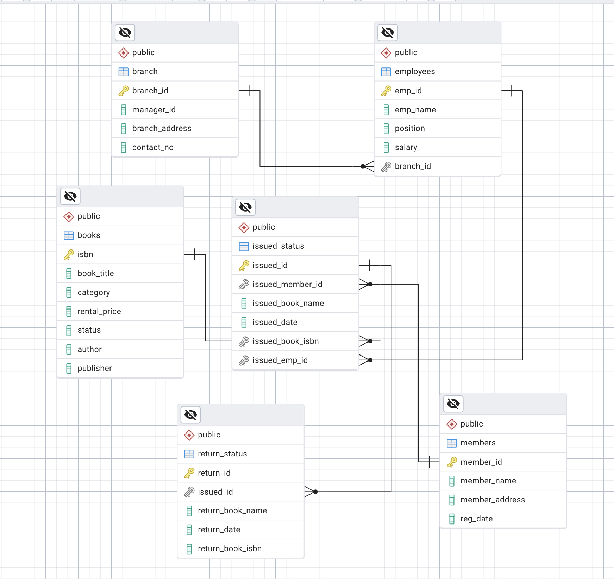

# Library Management System using SQL Project --P2

## Project Overview

**Project Title**: Library Management System  
**Level**: Intermediate  
**Database**: `library_db`

This project demonstrates the implementation of a Library Management System using SQL. It includes creating and managing tables, performing CRUD operations, and executing advanced SQL queries. The goal is to showcase skills in database design, manipulation, and querying.


## Objectives

1. **Set up the Library Management System Database**: Create and populate the database with tables for branches, employees, members, books, issued status, and return status.
2. **CRUD Operations**: Perform Create, Read, Update, and Delete operations on the data.
3. **CTAS (Create Table As Select)**: Utilize CTAS to create new tables based on query results.
4. **Advanced SQL Queries**: Develop complex queries to analyze and retrieve specific data.

## Project Structure

### 1. Database Setup


- **Database Creation**: Created a database named `library_db`.
- **Table Creation**: Created tables for branches, employees, members, books, issued status, and return status. Each table includes relevant columns and relationships.

```sql
CREATE DATABASE library_db;

DROP TABLE IF EXISTS branch;
Create Table branch(
	branch_id	varchar(10) PRIMARY KEY,
	manager_id	varchar(10),
	branch_address	varchar(225),
	contact_no varchar (10)
	);

Alter table branch --changing the data type for some columns in branch table.
Alter column contact_no type varchar(50);


-- creating employees table
DROP TABLE IF EXISTS employees;
Create Table employees(
	emp_id	varchar(10) primary key,
	emp_name varchar (255),
	position varchar (25),	
	salary INT,
	branch_id varchar (25) --FK
	);

-- creating books table
DROP TABLE IF EXISTS books;
Create Table books(
	isbn varchar(20) primary key,
	book_title varchar(75),
	category varchar(50),
	rental_price float,
	status varchar(15),
	author varchar(20),
	publisher varchar(55)
	);
	
Alter table books -- changing the data type for some columns in books table
Alter column category type varchar(50), 
Alter column author type varchar(50);


-- creating members table
DROP TABLE IF EXISTS members;
Create Table members(
	member_id varchar(10) primary key,
	member_name varchar (25),
	member_address varchar(75),
	reg_date date
	);


-- creating issued status table
DROP TABLE IF EXISTS issued_status;
Create Table issued_status(
	issued_id varchar(10) primary key,
	issued_member_id varchar(10), --FK
	issued_book_name varchar(75),	
	issued_date date,	
	issued_book_isbn varchar(25), --FK
	issued_emp_id varchar(10) --FK
	);


-- creating return_status table
DROP TABLE IF EXISTS return_status;
Create Table return_status(
	return_id varchar(10) primary key,
	issued_id varchar(10), --FK
	return_book_name varchar(75),
	return_date date,
	return_book_isbn varchar(20)
	);


-- Defining the relationships between the keys

-- FOREIGN KEY
ALTER TABLE issued_status
ADD CONSTRAINT fk_members
FOREIGN KEY (issued_member_id)
REFERENCES members(member_id); 

ALTER TABLE issued_status
ADD CONSTRAINT fk_books
FOREIGN KEY (issued_book_isbn)
REFERENCES books(isbn); 

ALTER TABLE issued_status
ADD CONSTRAINT fk_employees
FOREIGN KEY (issued_emp_id)
REFERENCES employees(emp_id); 

ALTER TABLE employees
ADD CONSTRAINT fk_branch
FOREIGN KEY (branch_id)
REFERENCES branch(branch_id); 

ALTER TABLE return_status
ADD CONSTRAINT fk_issued_status
FOREIGN KEY (issued_id)
REFERENCES issued_status(issued_id); 

```

### 2. CRUD Operations

- **Create**: Inserted sample records into the `books` table.
- **Read**: Retrieved and displayed data from various tables.
- **Update**: Updated records in the `employees` table.
- **Delete**: Removed records from the `members` table as needed.

**Task 1. Create a New Book Record**
-- "978-1-60129-456-2', 'To Kill a Mockingbird', 'Classic', 6.00, 'yes', 'Harper Lee', 'J.B. Lippincott & Co.')"

```sql
INSERT INTO books(isbn, book_title, category, rental_price, status, author, publisher)
Values 
('978-1-60129-456-2', 'To Kill a Mockingbird', 'Classic', 6.00, 'yes', 'Harper Lee', 'J.B. Lippincott & Co.');
SELECT * FROM books;
```
**Task 2: Update an Existing Member's Address**

```sql
UPDATE members
SET member_address = '125 Main St'
WHERE member_id = 'C101'; 
```

**Task 3: Delete a Record from the Issued Status Table**
-- Objective: Delete the record with issued_id = 'IS121' from the issued_status table.

```sql
DELETE from issued_status
WHERE 'issued_id' = 'IS121';
```

**Task 4: Retrieve All Books Issued by a Specific Employee**
-- Objective: Select all books issued by the employee with emp_id = 'E101'.
```sql
SELECT *
FROM issued_status
WHERE issued_emp_id = 'E101'
```


**Task 5: List Members Who Have Issued More Than One Book**
-- Objective: Use GROUP BY to find members who have issued more than one book.

```sql
SELECT issued_emp_id,
	count(issued_id) as total_book_issued
FROM issued_status
GROUP BY issued_emp_id
HAVING count(issued_id) > 1
```

### 3. CTAS (Create Table As Select)

- **Task 6: Create Summary Tables**: Used CTAS to generate new tables based on query results - each book and total book_issued_cnt**

```sql
CREATE TABLE book_cnts
AS
SELECT 
	b.isbn,
	b.book_title,
	count (ist.issued_id) as no_issued
FROM books as b
JOIN issued_status as ist
ON ist.issued_book_isbn = b.isbn
Group by b.isbn, b.book_title;

```


### 4. Data Analysis & Findings

The following SQL queries were used to address specific questions:

Task 7. **Retrieve All Books in a Specific Category**:

```sql
SELECT *
FROM books
WHERE category = 'Classic';
```

8. **Task 8: Find Total Rental Income by Category**:

```sql
SELECT 
	b.category,
	sum (b.rental_price) as rental_income,
	count(*) as no_issued
FROM books as b
JOIN issued_status as ist
ON ist.issued_book_isbn = b.isbn
Group by category
```

9. **List Members Who Registered in the Last 180 Days**:
```sql
Select *
from members
where reg_date >= current_date - interval '180 days'
```

10. **List Employees with Their Branch Manager's Name and their branch details**:

```sql
select 
            e1.*, 
	b.manager_id,
	e2.emp_name as manager
from employees as e1
join branch as b
on e1.branch_id = b.branch_id
join employees as e2
on b.manager_id = e2.emp_id;
```

Task 11. **Create a Table of Books with Rental Price Above a Certain Threshold**:
```sql
drop table if exists books_price_greater_than_7;
create table books_price_greater_than_7
as
select *
from books
Where rental_price > 7;
```

Task 12: **Retrieve the List of Books Not Yet Returned**
```sql
select 
	b.isbn,
	b.book_title,
	ist.issued_book_name,
	b.category
from books as b
join issued_status as ist
on b.isbn = ist.issued_book_isbn
left join return_status as rst
on ist.issued_id = rst.issued_id
where return_id is null 
```

## Advanced SQL Operations

**Task 13: Identify Members with Overdue Books**  
Write a query to identify members who have overdue books (assume a 30-day return period). Display the member's_id, member's name, book title, issue date, and days overdue.

```sql
Select 
	iss.issued_id,
	iss.issued_book_name as book_name,
	mem.member_name,
	iss.issued_date,
	current_date - iss.issued_date as over_dues
from issued_status as iss
left join members as mem
on iss.issued_member_id = mem.member_id
left join return_status as rs
on iss.issued_id = rs.issued_id

where rs.return_date is Null 
and (current_date - iss.issued_date) > 300

order by mem.member_id;
```


**Task 14: Update Book Status on Return**  
Write a query to update the status of books in the books table to "Yes" when they are returned (based on entries in the return_status table).


```sql

CREATE OR REPLACE PROCEDURE add_return_records(p_return_id VARCHAR (10), p_issued_id VARCHAR (10))
LANGUAGE plpgsql
AS $$
DECLARE
	v_isbn VARCHAR (20);
	v_book_name VARCHAR (75);
BEGIN
-- all logic and code here
-- inserting into returns based on users input
	INSERT  INTO return_status(return_id, issued_id, return_date)
	VALUES
		(p_return_id, p_issued_id, current_date);

	SELECT
	issued_book_isbn,
	issued_book_name
	INTO
	v_isbn,
	v_book_name
	FROM issued_status
	WHERE issued_id = p_issued_id;
	
	UPDATE books
	SET Status = 'yes'
	WHERE isbn = v_isbn;

	RAISE NOTICE 'Thank you for returning the book: %', v_book_name;

END;
$$


-- Testing FUNCTION add_return_records

issued_id = IS135
ISBN = WHERE isbn = '978-0-307-58837-1'

SELECT * FROM books
WHERE isbn = '978-0-307-58837-1';

SELECT * FROM issued_status
WHERE issued_book_isbn = '978-0-307-58837-1';

SELECT * FROM return_status
WHERE issued_id = 'IS135';

-- calling function 
CALL add_return_records('RS138', 'IS135', 'Good');

-- calling function 
CALL add_return_records('RS148', 'IS140', 'Good');

```


**Task 15: Branch Performance Report**  
Create a query that generates a performance report for each branch, showing the number of books issued, the number of books returned, and the total revenue generated from book rentals.

```sql
Create table branch_report
As
Select 
	t1.branch_id, 
	t1.manager_id, 
	count(t1.issued_id) as issued_count, 
	count(t1.return_id) as return_count, 
	sum(t1.rental_price) as total_revenue
From
(
select 
	br.branch_id, 
	ist.issued_id, 
	ist.issued_date, 
	rt.return_date, 
	rt.return_id, 
	bk.book_title, 
	bk.rental_price, 
	br.manager_id
from issued_status as ist
left join employees as emp
on ist.issued_emp_id = emp.emp_id
left join branch as br
on emp.branch_id = br.branch_id
join books as bk
on ist.issued_book_isbn = bk.isbn
left join return_status as rt
on ist.issued_id = rt.issued_id

)as t1

Group by t1.branch_id, t1.manager_id;

select * from branch_report;
```


### Remarks:
1. Manager E109 oversees Branches B001, B002, and B003, which together generated a total revenue of $143.5. Branch B001 is the top performer under E109, with $111.5 in revenue. Manager E110 manages Branches B004 and B005, which together generated $76.5 in revenue. Branch B005 earned $50, making it the highest revenue generator under E110.
2. E109's branches outperform E110's in terms of total revenue. Branch B001 stands out as the single most profitable branch. Returns are highest at Branch B001 (9) and lowest (0) at Branches B002 and B003, suggesting different return behaviors or product types.


**Task 16: CTAS: Create a Table of Active Members**  
Use the CREATE TABLE AS (CTAS) statement to create a new table active_members containing members who have issued at least one book in the last 14 months.

```sql

Create table active_members
As
Select * from members
Where member_id in (Select
                          Distinct issued_member_id
			  From issued_status
		    Where
			  issued_date >= current_date - interval '14 months'
					)

select * from active_members;

```


**Task 17: Find Employees with the Most Book Issues Processed**  
Write a query to find the top 3 employees who have processed the most book issues. Display the employee name, number of books processed, and their branch.

```sql
Select emp.emp_name, emp.emp_id, count(ist.issued_id) as no_books_processed
From issued_status as ist
Join employees as emp
on ist.issued_emp_id = emp.emp_id

Group by emp.emp_name, emp.emp_id

Order by no_books_processed desc;
```


### Remarks: 
Laura Martinez and Michelle Ramirez processed the most books (6 each), followed by Jessica Taylor, Sarah Brown, and Emily Davis (4 each).Mike Johnson processed the fewest, with just 1 book.
Overall, book processing activity is concentrated among a few top performers.


**Task 18: Stored Procedure**
Objective:
Create a stored procedure to manage the status of books in a library system.
Description:
Write a stored procedure that updates the status of a book in the library based on its issuance. The procedure should function as follows:
The stored procedure should take the book_id as an input parameter.
The procedure should first check if the book is available (status = 'yes').
If the book is available, it should be issued, and the status in the books table should be updated to 'no'.
If the book is not available (status = 'no'), the procedure should return an error message indicating that the book is currently not available.

```sql

Create or Replace Procedure issue_book(p_issued_id Varchar(10), p_issued_member_id Varchar (10), p_issued_book_isbn Varchar(25), p_issued_emp_id Varchar(10))
Language plpgsql
As $$

Declare
-- all the variables
	v_status Varchar(15);

Begin
-- all the code and logic
	--checking if book is available 'yes'
	Select 
		status 
		Into
		v_status
	From books 
	Where isbn = p_issued_book_isbn;

	If v_status = 'yes' then
	
		Insert Into issued_status(issued_id,issued_member_id, issued_date, issued_book_isbn, issued_emp_id)
		Values 
			(p_issued_id, p_issued_member_id, current_date, p_issued_book_isbn, p_issued_emp_id);

		Update books
			Set status = 'no'
		Where isbn = p_issued_book_isbn;

		Raise Notice 'Book records added successfully for book isbn: %', p_issued_book_isbn;
	Else
		Raise Notice 'Sorry the book you have requested is unavailable book isbn: %', p_issued_book_isbn;	
	End if;

End;
$$


-- Testing The function
SELECT * FROM books;
-- "978-0-553-29698-2" -- yes
-- "978-0-375-41398-8" -- no
SELECT * FROM issued_status;

CALL issue_book('IS155', 'C108', '978-0-553-29698-2', 'E104');
CALL issue_book('IS156', 'C108', '978-0-375-41398-8', 'E104');

SELECT * FROM books
WHERE isbn = '978-0-375-41398-8'

```

## Reports
**Database Structure**: Created tables: books, members, employees, issued_status, return_status, and branch.
Established relationships using foreign key constraints to ensure data integrity.

**Core Functionalities**: Automated book issuance and return processes using stored procedures (issue_book and add_return_records).
Updated book statuses dynamically based on issuance and returns.

**Analytical Queries**:Identified overdue books, active members, and top-performing employees.
Generated branch performance reports, including issued/returned books and total revenue.

**Advanced Features**: Used CTAS to create summary tables (e.g., active members, branch reports).
Retrieved insights like rental income by category and books not yet returned.

##### Key Insights:
- Operational Efficiency: Automated processes reduce manual errors and improve workflow.
- Customer Engagement: Identified active members and overdue books for better service.
- Revenue Optimization: Highlighted high-performing book categories for inventory decisions.
- Employee Performance: Recognized top employees for accountability and rewards.


## Conclusion

This project demonstrates the effective use of SQL for managing library operations, automating workflows, and generating actionable insights to improve decision-making.


